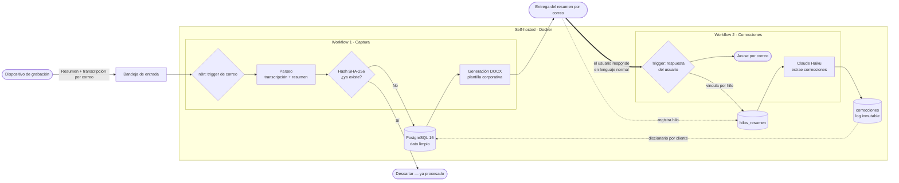

<h1 align="center">Meeting Intelligence Pipeline</h1>

<p align="center">
  <i>De reunión hablada a documento entregado — sin que nadie cambie cómo trabaja.</i>
</p>

<p align="center">
  
  
  
</p>

<p align="center">
  
  
  
</p>

---

## 📖 El problema

Las reuniones generan información valiosa que casi siempre se pierde. La que se
conserva, se conserva a base de esfuerzo: alguien toma notas, las ordena, las
formatea, las guarda en algún sitio y las reparte. Es trabajo manual, lento y
fácil de saltarse cuando hay prisa.

La mayoría de herramientas del mercado resuelven esto **añadiendo** una
herramienta más: una app que aprender, un panel que rellenar, un flujo nuevo que
mantener. Eso traslada el coste, no lo elimina.

## 💡 El enfoque

> **Este sistema no añade pasos al usuario. Se los quita.**

El dueño del negocio no instala nada, no rellena formularios y no aprende ninguna
herramienta nueva. Sigue haciendo exactamente lo que ya hacía: tener su reunión.
Todo lo demás —transcribir, estructurar, deduplicar, archivar y documentar—
ocurre solo, en segundo plano, sobre lo que él **ya** produce.

El resultado le llega por el mismo canal que ya usa todos los días: su correo.

## 🧩 Qué hace

El sistema son **dos workflows** que comparten la misma base de datos. Ninguno de
los dos le pide al usuario que aprenda una herramienta nueva.

### Workflow 1 — Captura

Un dispositivo **Plaud** graba y transcribe la reunión y envía un resumen por
correo. A partir de ahí, el pipeline automatizado:

1. **Detecta** el correo entrante con la transcripción y el resumen.
2. **Parsea** ambos: separa transcripción literal de resumen estructurado.
3. **Deduplica** por hash **SHA-256** del contenido — una misma reunión nunca se
   procesa ni se almacena dos veces.
4. **Persiste** el dato limpio en **PostgreSQL 16**, listo para consultas y
   agregaciones futuras.
5. **Genera** un documento **Word (.docx)** con plantilla corporativa.
6. **Entrega** el documento por correo, automáticamente — y **registra el hilo**
   de ese correo para poder enlazar después cualquier respuesta con su reunión.

### Workflow 2 — Correcciones (el sistema aprende)

Las transcripciones automáticas fallan sobre todo en **nombres propios**:
personas, variedades de semilla, fincas. En lugar de montar un panel para
gestionar excepciones, el sistema reutiliza el canal que el usuario ya tiene
abierto: **el propio correo del resumen**.

> **Corregir = responder al correo en lenguaje normal.**
> «Donde pone *Martínez* es *Benítez*, y la variedad era *Lamuyo* no *Lamayo*».

1. **Detecta** la respuesta del usuario al resumen y la **vincula** con su
   reunión por el hilo de correo.
2. **Extrae** las correcciones del texto libre con **Claude Haiku**, que las
   devuelve en JSON estructurado (`texto_erroneo → texto_correcto`, tipificado).
3. **Guarda** cada corrección en un log inmutable, sin tocar la transcripción
   original (la verdad de origen no se reescribe).
4. **Acusa recibo** por correo, siempre, para que el usuario sepa que llegó.

Cada corrección alimenta un **diccionario por cliente**: cuando un mismo error se
corrige de forma recurrente, el sistema tiene la base para auto-corregirlo en
futuras transcripciones. El usuario no entrena nada a propósito: **entrena el
sistema con solo contestar un correo**.

## 🏗️ Arquitectura



## 🧰 Stack

| Capa | Tecnología |
|---|---|
| Orquestación | n8n (self-hosted) |
| Base de datos | PostgreSQL 16 |
| Infraestructura | Docker / Docker Compose |
| Documentos | Generación de DOCX con plantilla |
| Captura | Dispositivo Plaud (grabación + transcripción) |
| Extracción de correcciones | Claude Haiku (texto libre → JSON) |
| Entrada/salida | Correo electrónico (Gmail) |

## 🎯 Decisiones de diseño interesantes

**Deduplicación por hash SHA-256.**
Cada reunión se identifica por el hash de su contenido. Antes de procesar o
guardar nada, el pipeline comprueba si ese hash ya existe. Si un correo se
reenvía, se reintenta o llega duplicado, el sistema lo reconoce y lo ignora. El
resultado es **idempotencia**: ejecutar el flujo dos veces produce el mismo
estado, sin duplicados ni reprocesos.

**Separar la captura individual de la agregación futura.**
La Fase 1 se centra en capturar *bien* cada reunión, una a una. El diseño deja la
puerta abierta —pero no implementada— a agregaciones (semanal, mensual, anual)
sin reescribir la captura. Capturar y agregar son responsabilidades distintas y
se mantienen desacopladas a propósito.

**Mantener el dato limpio en origen.**
Como el dato se normaliza y deduplica *antes* de persistirse, la base de datos no
acumula ruido. Eso hace que las agregaciones posteriores sean fiables por
construcción: no hay que limpiar después lo que se guardó sucio.

**Corregir sin añadir una herramienta.**
El sistema podría tener un panel para gestionar correcciones de nombres. No lo
tiene a propósito: el usuario corrige **respondiendo al correo del resumen en
lenguaje natural**, y Claude Haiku traduce ese texto libre a correcciones
estructuradas. La complejidad (parsear, tipificar, vincular con la reunión)
queda del lado del sistema, no del usuario.

**La transcripción es inmutable; las correcciones son una capa aparte.**
Nunca se reescribe la transcripción original. Las correcciones viven en su propia
tabla, como un log con autor y fecha. Eso preserva la verdad de origen y, a la
vez, construye un **diccionario por cliente** que permite auto-corregir errores
recurrentes en el futuro sin reprocesar nada.

**Self-hosted sobre Docker.**
Todo el stack corre en contenedores propios. El dato sensible (transcripciones de
reuniones) no sale a servicios de terceros más allá de lo estrictamente
necesario, y el despliegue es reproducible.

## 🔁 Cómo se replicaría (alto nivel)

> Este repo es una **demo de portfolio**. No incluye credenciales, datos reales ni
> secretos. Los workflows de n8n están anonimizados y los valores sensibles son
> placeholders (`<TU_...>`).

1. Levantar n8n + PostgreSQL 16 con Docker (Compose).
2. Aplicar el esquema y las tablas de la capa de aprendizaje:
   [`db/schema.sql`](db/schema.sql), [`db/vinculo_hilo_resumen.sql`](db/vinculo_hilo_resumen.sql)
   y [`db/correcciones.sql`](db/correcciones.sql).
3. Importar los dos workflows anonimizados:
   [`workflow/workflow-captura.json`](workflow/workflow-captura.json) y
   [`workflow/workflow-correcciones.json`](workflow/workflow-correcciones.json).
4. Rellenar las credenciales propias en n8n (Gmail, PostgreSQL y la API de
   Anthropic para el workflow de correcciones). Nada de esto viaja en el repo:
   todos los valores sensibles son placeholders `<TU_...>`.
5. Ajustar la plantilla del documento a la marca propia.

## 🗂️ Estructura

```text
meeting-intelligence-pipeline/
├─ db/
│  ├─ schema.sql                 # estructura base (sin datos)
│  ├─ vinculo_hilo_resumen.sql   # enlaza hilo de correo ↔ reunión
│  └─ correcciones.sql           # log inmutable de correcciones
├─ workflow/
│  ├─ workflow-captura.json      # export n8n: captura (anonimizado)
│  └─ workflow-correcciones.json # export n8n: correcciones (anonimizado)
├─ docs/                # capturas y diagramas
├─ .env.example         # plantilla de variables de entorno
├─ LICENSE
├─ CONTRIBUTING.md
└─ README.md
```

## 🤝 Contribuir

Lee [CONTRIBUTING.md](CONTRIBUTING.md). Issues y PRs bienvenidos.

## 📄 Licencia

Distribuido bajo licencia **MIT**. Ver [LICENSE](LICENSE).

## 📡 Contacto

**Javier Núñez Paredes — J13**

[](https://triskelai.com)
[](https://www.linkedin.com/in/javier-n%C3%BA%C3%B1ez-paredes-81a66b159/)
