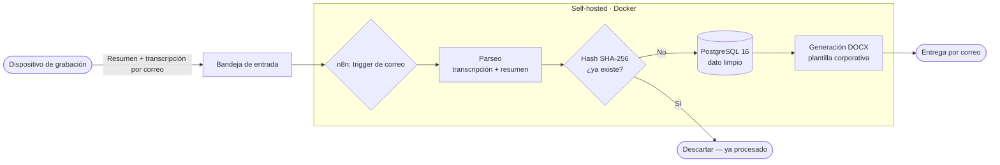

<h1 align="center">Meeting Intelligence Pipeline</h1>

<p align="center">
  <i>De reunión hablada a documento entregado — sin que nadie cambie cómo trabaja.</i>
</p>

<p align="center">
  
  
  
</p>

<p align="center">
  
  
  
</p>

---

## 📖 El problema

Las reuniones generan información valiosa que casi siempre se pierde. La que se
conserva, se conserva a base de esfuerzo: alguien toma notas, las ordena, las
formatea, las guarda en algún sitio y las reparte. Es trabajo manual, lento y
fácil de saltarse cuando hay prisa.

La mayoría de herramientas del mercado resuelven esto **añadiendo** una
herramienta más: una app que aprender, un panel que rellenar, un flujo nuevo que
mantener. Eso traslada el coste, no lo elimina.

## 💡 El enfoque

> **Este sistema no añade pasos al usuario. Se los quita.**

El dueño del negocio no instala nada, no rellena formularios y no aprende ninguna
herramienta nueva. Sigue haciendo exactamente lo que ya hacía: tener su reunión.
Todo lo demás —transcribir, estructurar, deduplicar, archivar y documentar—
ocurre solo, en segundo plano, sobre lo que él **ya** produce.

El resultado le llega por el mismo canal que ya usa todos los días: su correo.

## 🧩 Qué hace (Fase 1)

Un dispositivo **Plaud** graba y transcribe la reunión y envía un resumen por
correo. A partir de ahí, el pipeline automatizado:

1. **Detecta** el correo entrante con la transcripción y el resumen.
2. **Parsea** ambos: separa transcripción literal de resumen estructurado.
3. **Deduplica** por hash **SHA-256** del contenido — una misma reunión nunca se
   procesa ni se almacena dos veces.
4. **Persiste** el dato limpio en **PostgreSQL 16**, listo para consultas y
   agregaciones futuras.
5. **Genera** un documento **Word (.docx)** con plantilla corporativa.
6. **Entrega** el documento por correo, automáticamente.

## 🏗️ Arquitectura



## 🧰 Stack

| Capa | Tecnología |
|---|---|
| Orquestación | n8n (self-hosted) |
| Base de datos | PostgreSQL 16 |
| Infraestructura | Docker / Docker Compose |
| Documentos | Generación de DOCX con plantilla |
| Captura | Dispositivo Plaud (grabación + transcripción) |
| Entrada/salida | Correo electrónico (Gmail) |

## 🎯 Decisiones de diseño interesantes

**Deduplicación por hash SHA-256.**
Cada reunión se identifica por el hash de su contenido. Antes de procesar o
guardar nada, el pipeline comprueba si ese hash ya existe. Si un correo se
reenvía, se reintenta o llega duplicado, el sistema lo reconoce y lo ignora. El
resultado es **idempotencia**: ejecutar el flujo dos veces produce el mismo
estado, sin duplicados ni reprocesos.

**Separar la captura individual de la agregación futura.**
La Fase 1 se centra en capturar *bien* cada reunión, una a una. El diseño deja la
puerta abierta —pero no implementada— a agregaciones (semanal, mensual, anual)
sin reescribir la captura. Capturar y agregar son responsabilidades distintas y
se mantienen desacopladas a propósito.

**Mantener el dato limpio en origen.**
Como el dato se normaliza y deduplica *antes* de persistirse, la base de datos no
acumula ruido. Eso hace que las agregaciones posteriores sean fiables por
construcción: no hay que limpiar después lo que se guardó sucio.

**Self-hosted sobre Docker.**
Todo el stack corre en contenedores propios. El dato sensible (transcripciones de
reuniones) no sale a servicios de terceros más allá de lo estrictamente
necesario, y el despliegue es reproducible.

## 🔁 Cómo se replicaría (alto nivel)

> Este repo es una **demo de portfolio**. No incluye credenciales, datos reales ni
> secretos. El workflow de n8n está anonimizado y los valores sensibles son
> placeholders (`<TU_...>`).

1. Levantar n8n + PostgreSQL 16 con Docker (Compose).
2. Aplicar el esquema de base de datos: [`db/schema.sql`](db/schema.sql).
3. Importar el workflow anonimizado: [`workflow/`](workflow/).
4. Rellenar las credenciales propias en n8n (correo IMAP/SMTP, conexión a la BD).
   Nada de esto viaja en el repo.
5. Ajustar la plantilla del documento a la marca propia.

## 🗂️ Estructura

```text
meeting-intelligence-pipeline/
├─ db/
│  └─ schema.sql        # estructura de tablas (sin datos)
├─ workflow/
│  └─ workflow.json     # export de n8n, anonimizado
├─ docs/                # capturas y diagramas
├─ .env.example         # plantilla de variables de entorno
├─ LICENSE
├─ CONTRIBUTING.md
└─ README.md
```

## 🤝 Contribuir

Lee [CONTRIBUTING.md](CONTRIBUTING.md). Issues y PRs bienvenidos.

## 📄 Licencia

Distribuido bajo licencia **MIT**. Ver [LICENSE](LICENSE).

## 📡 Contacto

**Javier Núñez Paredes — J13**

[](https://triskelai.com)
[](https://www.linkedin.com/in/javier-n%C3%BA%C3%B1ez-paredes-81a66b159/)
